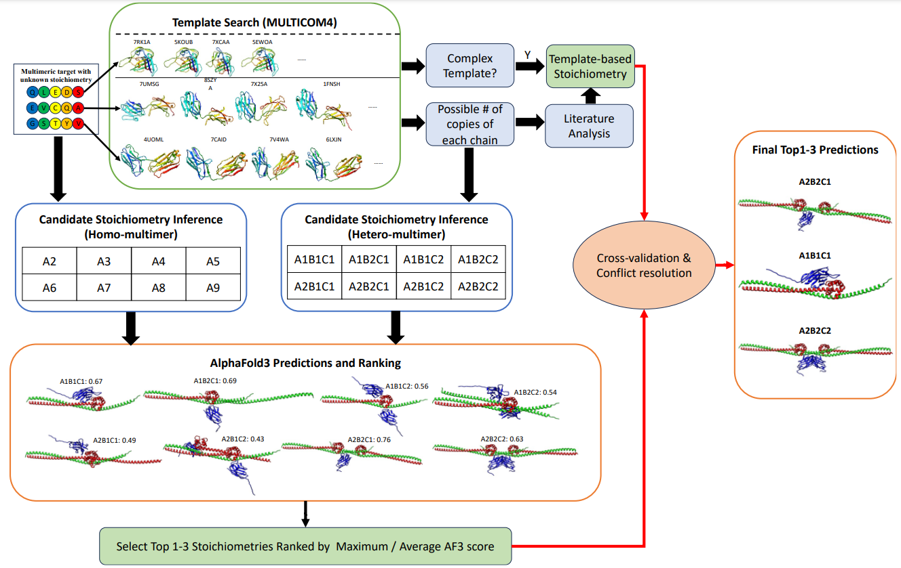

# Prestoi
Predicting stoichiometry of protein complexes using AlphaFold3 and structural templates

## The workflow of the Alphafold3 based stoichiometry prediction system


This program handles the Alphafold3-based stoichiometry prediction in the above diagram.

# Installation
The program installation requires two steps
- Installation of Alphafold3 program
- Configuration of Alphafold3 program in the Stoichiometry prediction program

## 1 Alphafold3 installation. (Skip to step 2 if Alphafold3 has already been installed)
### Begin with the installation of AlphaFold3 program using the following. 
https://github.com/google-deepmind/alphafold3/blob/main/docs/installation.md

Test whether AlphaFold3 program is working properly
Once you have installed AlphaFold 3, you can test your setup using e.g. the
following input JSON file named `fold_input.json`:

```json
{
  "name": "2PV7",
  "sequences": [
    {
      "protein": {
        "id": ["A", "B"],
        "sequence": "GMRESYANENQFGFKTINSDIHKIVIVGGYGKLGGLFARYLRASGYPISILDREDWAVAESILANADVVIVSVPINLTLETIERLKPYLTENMLLADLTSVKREPLAKMLEVHTGAVLGLHPMFGADIASMAKQVVVRCDGRFPERYEWLLEQIQIWGAKIYQTNATEHDHNMTYIQALRHFSTFANGLHLSKQPINLANLLALSSPIYRLELAMIGRLFAQDAELYADIIMDKSENLAVIETLKQTYDEALTFFENNDRQGFIDAFHKVRDWFGDYSEQFLKESRQLLQQANDLKQG"
      }
    }
  ],
  "modelSeeds": [1],
  "dialect": "alphafold3",
  "version": 1
}
```

You can then run AlphaFold 3 using the following command:

```
docker run -it \
    --volume $HOME/af_input:/root/af_input \
    --volume $HOME/af_output:/root/af_output \
    --volume <MODEL_PARAMETERS_DIR>:/root/models \
    --volume <DATABASES_DIR>:/root/public_databases \
    --gpus all \
    alphafold3 \
    python run_alphafold.py \
    --json_path=/root/af_input/fold_input.json \
    --model_dir=/root/models \
    --output_dir=/root/af_output
```

## 3 Configuration of Alphafold3 for Stoichiometry prediction
### Run the configure_af3.py to create a configuration file
This step will create a config.json file in the working directory. 

  ```
  python configure_af3.py --af3_program_path /path/to/alphafold3_program/ --af3_params_path /path/to/alphafold3_parameters/ --af3_db_path /path/to/alphafold3_databases/
  ```
Note: Make sure the paths are valid. In case of changes of the above three paths in the future, make sure to rerun this program with correct paths.

## Run the stoichiometry_prediction.py
### Homomultimer Example
```
python stoichiometry_prediction.py --input_fasta /path/to/input_fasta --stoichiometries A2,A3,A4 --output_path /path/to/output_dir  --num_models 25
```
### Heteromultimer Example
```
python stoichiometry_prediction.py --input_fasta /path/to/input_fasta --stoichiometries A1B1,A2B2,A9B18 --output_path /path/to/output_dir  --num_models 25
```


