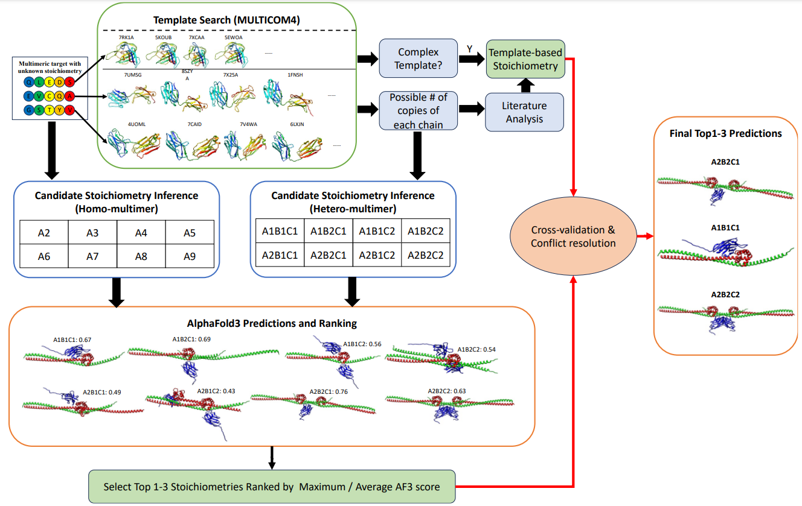
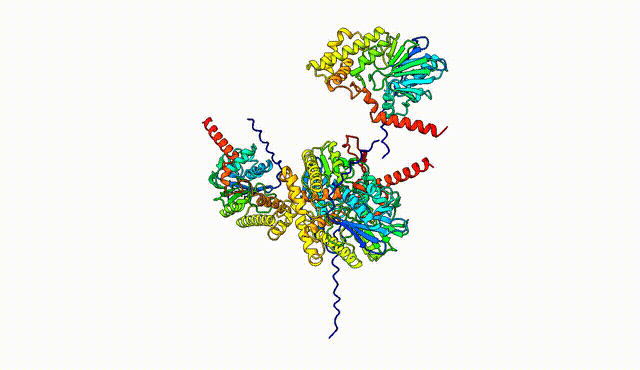
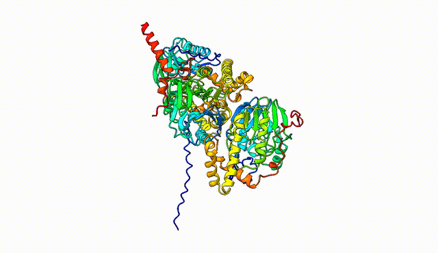
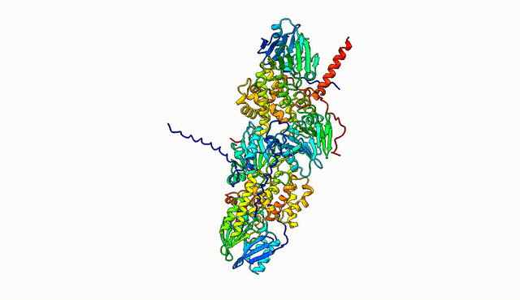
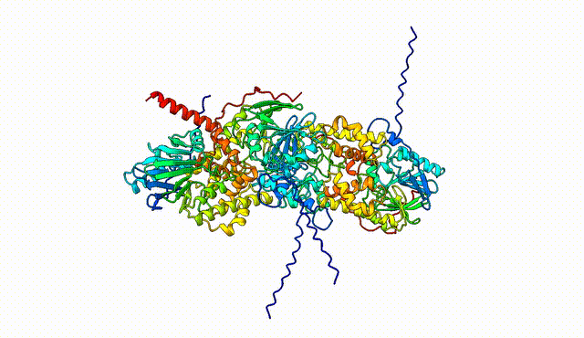

# PreStoi
## Predicting stoichiometry of protein complexes by integrating AlphaFold3 and templates.

This system was built and tested to predict the correct stoichiometry for targets released without stochiometry information (Phase 0) in the 16th world-wide Critical Assessment of Techniques for Protein Structure Prediction (CASP16) concluded in December 2024.

Using this system, MULTICOM4 achieved remarkable success, ranking 1st in protein complex structure prediction for such targets. 

## The workflow of the Stoichiometry Prediction system utilized by MULTICOM4 in CASP16


### This program handles the AlphaFold3-based stoichiometry prediction part in the above diagram.

# Installation and Configuration

The program installation requires two steps
1. Alphafold3 installation.
2. Configure Alphafold3 to Stoichiometry Prediction program


## 1. AlphaFold3 installation. (Skip to step 2 if AlphaFold3 has already been installed)
### Begin with the installation of AlphaFold3 program using the following. 
https://github.com/google-deepmind/alphafold3/blob/main/docs/installation.md

Test whether AlphaFold3 program is working properly.
Once you have installed AlphaFold3, you can test your setup using e.g. the
following input JSON file named `fold_input.json`:

```json
{
  "name": "2PV7",
  "sequences": [
    {
      "protein": {
        "id": ["A", "B"],
        "sequence": "GMRESYANENQFGFKTINSDIHKIVIVGGYGKLGGLFARYLRASGYPISILDREDWAVAESILANADVVIVSVPINLTLETIERLKPYLTENMLLADLTSVKREPLAKMLEVHTGAVLGLHPMFGADIASMAKQVVVRCDGRFPERYEWLLEQIQIWGAKIYQTNATEHDHNMTYIQALRHFSTFANGLHLSKQPINLANLLALSSPIYRLELAMIGRLFAQDAELYADIIMDKSENLAVIETLKQTYDEALTFFENNDRQGFIDAFHKVRDWFGDYSEQFLKESRQLLQQANDLKQG"
      }
    }
  ],
  "modelSeeds": [1],
  "dialect": "alphafold3",
  "version": 1
}
```

You can then run AlphaFold 3 using the following command and check whether AlphaFold3 is running correctly:

```
docker run -it \
    --volume $HOME/af_input:/root/af_input \
    --volume $HOME/af_output:/root/af_output \
    --volume <MODEL_PARAMETERS_DIR>:/root/models \
    --volume <DATABASES_DIR>:/root/public_databases \
    --gpus all \
    alphafold3 \
    python run_alphafold.py \
    --json_path=/root/af_input/fold_input.json \
    --model_dir=/root/models \
    --output_dir=/root/af_output
```

## 2. Configure AlphaFold3 to Stoichiometry Prediction program

Clone the repository
```
git clone https://github.com/jianlin-cheng/prestoi
cd prestoi
```
Install pandas library
```
pip install pandas
```

### Run the configure_af3.py to create a config.json file 
```
python configure_af3.py --af3_program_path /path/to/alphafold3_program/ --af3_params_path /path/to/alphafold3_parameters/ --af3_db_path /path/to/alphafold3_databases/
```
This step will create a config.json file in the current working directory(prestoi) with the following information.
```json
{
  "af3_program_path": "/path/to/alphafold3_program/",
  "af3_params_path": "/path/to/alphafold3_parameters/",
  "af3_db_path": "/path/to/alphafold3_databases/"
}
```

Note: This step is only required to be run once. However, this can be run again in case the given three paths change. Make sure the paths are valid.

# Inference
## Run the stoichiometry_prediction.py
The script requires 4 arguments:
  1. input_fasta : file path to the target fasta file
  2. stoichiometries : comma separated valid stoichiometries intended to be tested
  3. output_path : desired output path for the results
  4. num_models : number of models(in the multiple of 5) intended to be generated for each stoichiometry

 
This script will run all the required steps and print the results upon completion. Also /path/to/output_dir/ will contain a directory named after the input fasta file name which will contain:
  - input_jsons/ which contains the json files generated to be fed as inputs to AlphaFold3
  - AlphaFold3 outputs generated for different stoichiometries
  - stoichiometry_results.csv which contains a table of maximum and average ranking scores for each stoichiometry.


### Homomultimer Example
```
python stoichiometry_prediction.py --input_fasta /path/to/T0270o.fasta --stoichiometries A2,A3,A4,A5,A6 --output_path /path/to/output_dir  --num_models 25
```

Example output for T0270o (True stoichiometry: A3):
```
Stoichiometry results for :  T0270o

Stoichiometry, Maximum ranking score, Average ranking score, Number of models
A2,0.2917254023268046,0.22109988348999923,25
A3,0.7356659644178217,0.6597546325500054,25
A4,0.4619621540111602,0.4311053457765267,25
A5,0.5574578147810352,0.47328416184068417,25
A6,0.5455593923883584,0.4632293540739206,25

!!!!!!!!!!Final Selection!!!!!!!!!!

Stoichiometry with the highest Maximum ranking score: A3
Stoichiometry with the highest Average ranking score: A3
```

**Target T0270o**
| **Stoichiometries** | **Maximum Ranking Score** | **Average Ranking Score** | **Visualization**              |
| ------------------ | ------------------------- | -------------------------- | ------------------------------- |
| A2            | 0.2917254023268046        | 0.22109988348999923        |  |
| A3            | **0.7356659644178217**        | **0.6597546325500054**         |  |
| A4            | 0.4619621540111602        | 0.4311053457765267         |  |
| A5            | 0.5574578147810352        | 0.47328416184068417        |  |
| A6            | 0.5455593923883584        | 0.4632293540739206         |  |


### Heteromultimer Example
```
python stoichiometry_prediction.py --input_fasta /path/to/H0208.fasta --stoichiometries A1B1,A1B2,A1B3,A2B1,A2B2,A2B3,A3B1,A3B2,A3B3 --output_path /path/to/output_dir  --num_models 25
```

Example output for H0208 (True stoichiometry: A1B1):
```
Stoichiometry results for :  H0208

Stoichiometry, Maximum ranking score, Average ranking score, Number of models
A1B1,0.9579082725495932,0.9449554292400113,25
A1B2,0.7371544130131423,0.5392889019139051,25
A1B3,0.3972130584449553,0.35706427566899235,25
A2B1,0.8581746709490917,0.7907662683364439,25
A2B2,0.8726062852868774,0.6886386376967493,25
A2B3,0.5666602198361169,-15.505672491186171,25
A3B1,0.7930352000013527,0.7656765671860422,25
A3B2,0.4979020342021519,0.40007180256585756,25
A3B3,0.4140460397693776,0.37972803742981975,25

!!!!!!!!!!Final Selection!!!!!!!!!!

Stoichiometry with the highest Maximum ranking score: A1B1
Stoichiometry with the highest Average ranking score: A1B1
```
**Target H0208**
| **Stoichiometries** | **Maximum Ranking Score** | **Average Ranking Score** | **Visualization**                |
|------------------ |-------------------------- |--------------------------- |---------------------------------- |
| A1B1         | **0.9579082725495932**        | **0.9449554292400113**         |  |
| A1B2         | 0.7371544130131423        | 0.5392889019139051         |  |
| A1B3         | 0.3972130584449553        | 0.35706427566899235        |  |
| A2B1         | 0.8581746709490917        | 0.7907662683364439         |  |
| A2B2         | 0.8726062852868774        | 0.6886386376967493         |  |
| A2B3         | 0.5666602198361169        | -15.505672491186171        |  |
| A3B1         | 0.7930352000013527        | 0.7656765671860422         |  |
| A3B2         | 0.4979020342021519        | 0.40007180256585756        |  |
| A3B3         | 0.4140460397693776        | 0.37972803742981975        |  |


## Citing This Work

If you find this work is useful, please cite: 

Liu, J., Neupane, P., & Cheng, J. (2025). Accurate Prediction of Protein Complex Stoichiometry by Integrating AlphaFold3 and Template Information. bioRxiv, 2025-01

```bibtex
@article {Liu2025.01.12.632663,
	author = {Liu, Jian and Neupane, Pawan and Cheng, Jianlin},
	title = {Accurate Prediction of Protein Complex Stoichiometry by Integrating AlphaFold3 and Template Information},
	elocation-id = {2025.01.12.632663},
	year = {2025},
	doi = {10.1101/2025.01.12.632663},
	publisher = {Cold Spring Harbor Laboratory},
	URL = {https://www.biorxiv.org/content/early/2025/01/15/2025.01.12.632663},
	eprint = {https://www.biorxiv.org/content/early/2025/01/15/2025.01.12.632663.full.pdf},
	journal = {bioRxiv}
}
```
